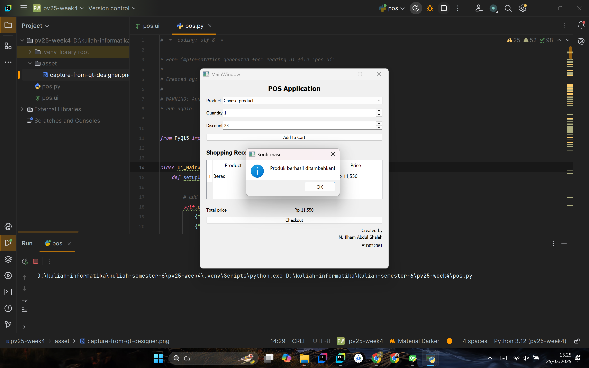

# Aplikasi Point of Sale (POS) Berbasis PyQt5

Aplikasi kasir sederhana yang dibangun menggunakan PyQt5 dengan antarmuka berbasis QTDesigner. 

## 👤 Data Mahasiswa
| Nama                   | NIM       |
|------------------------|-----------|
| M. ILHAM ABDUL SHALEH  | F1D022061 |

## 🛠️ Teknologi yang Digunakan
- Python 3.10+
- PyQt5
- QTDesigner

## 📋 Fitur Utama
1. Pemilihan produk melalui dropdown menu
2. Input jumlah barang dan diskon
3. Perhitungan total harga otomatis dengan diskon

## 🖼️ Screenshot Proses Pengembangan
**1. Desain Antarmuka di QTDesigner**  

**2. Konversi File .ui ke .py**  

**3. Tampilan Aplikasi Saat Dijalankan**  

